# PSNet5: Dataset Characterization

PSNet5 contains industrial point clouds from four scenes and five semantic classes: I-beams, pipes, pumps, rectangular beams and tanks. This report characterizes the complete local dataset, its preprocessing, spatial sampling and evaluation partitions.

## Integrity and inventory

The dataset contains **18 annotation files and 80,915,438 labeled points**. Each point has a position in space (X, Y, Z), a color (red, green, blue), and a semantic class such as pipe or pump. The class comes from the annotation file containing the point.

### Subsampling: reducing the number of points

Laser scans can contain many closely spaced measurements of the same surface. **Voxel subsampling** reduces this density by dividing space into small cubes, called voxels, and representing each occupied cube with one point. The baseline uses cubes with side length **0.04 coordinate units**, interpreted as 4 cm when the coordinates are in meters.

Within each cube, the baseline averages the point positions and colors and assigns the most frequent class label. The representative point is therefore an average location, not necessarily an original laser measurement. This produces **1,539,230 points across the four scenes**, about **1.90%** of the original count. The original files remain available for evaluation at full resolution. Subsampling reduces computation, but small details and class boundaries can change when several measurements are combined.

### KDTrees

A **KDTree** is a spatial search index built from the point coordinates. It answers questions such as “which points are within distance 2 of this location?” without scanning every point in the scene. It does not change the points or their labels; it helps the loader find neighborhoods efficiently.

### What the integrity checks establish

| Check | What was compared | Result |
|---|---|---|
| Input values | All annotation rows checked for non-finite numbers and invalid RGB values | No invalid rows found |
| Original scene caches | Every annotation point compared with its cached coordinates and colors, with class counts also checked | Match in all four areas, after the baseline's float32 coordinate conversion |
| Spatial search indices | Coordinates stored inside each KDTree compared with the associated subsampled point array | Match in all four areas |
| Regenerated subsampling | Recomputed positions, colors and labels compared with the existing 0.04-voxel caches | Exact match in all four areas, allowing for point ordering |

These checks establish consistency between the source files and the per-scene preprocessing. They do not independently establish whether every manual class annotation is correct. Combined training/validation caches and the saved mappings used to transfer predictions back to original points were not checked here.

The local dataset README does not explicitly confirm physical units. This report retains source coordinate units; the baseline interprets them as meters.

## Class distribution

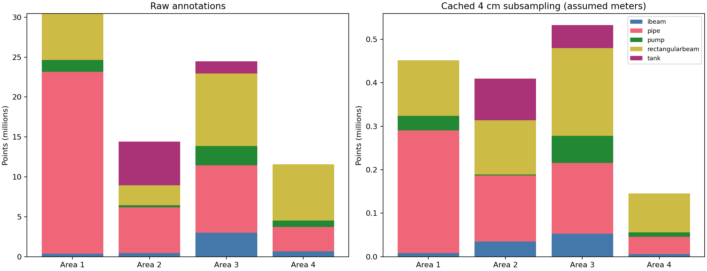

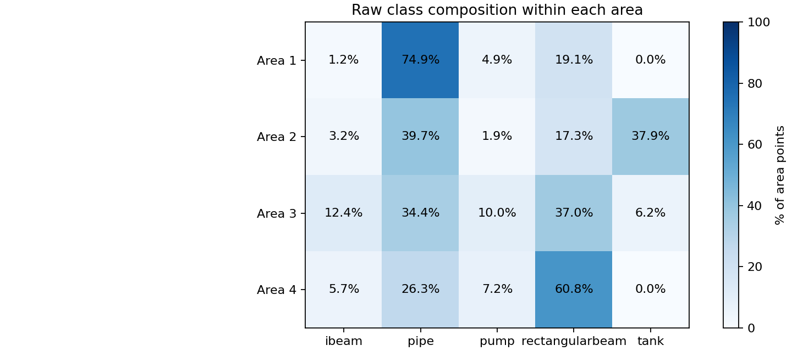

| Class | Raw points | Subsampled points | Retained |
|---|---:|---:|---:|
| ibeam | 4,506,466 | 101,842 | 2.26% |
| pipe | 39,973,956 | 636,482 | 1.59% |
| pump | 5,049,832 | 108,568 | 2.15% |
| rectangularbeam | 24,406,028 | 543,703 | 2.23% |
| tank | 6,979,156 | 148,635 | 2.13% |

Area 2 is the only training area containing tanks; Area 3 also has tanks but is reserved for final evaluation. Area 2 pumps retain only 2,551 of 279,617 raw points (0.91%). This is a point-count reduction, not proof that whole pump objects disappear. Subsampling changes the class proportions because point density varies across surfaces and scenes.

## Density and coordinates

The density below is raw points divided by the XY bounding-box area. It is a rough comparison, not true scanned surface density; empty space and stacked structures affect it.

| Area | XYZ extent (source units) | Raw points / XY bbox unit² | Raw Z range |
|---|---|---:|---|
| Area_1 | 32.15 × 43.40 × 5.95 | 21,829 | -1.78 to 4.16 |
| Area_2 | 23.67 × 26.09 × 28.55 | 23,324 | 78.81 to 107.35 |
| Area_3 | 35.37 × 41.98 × 9.63 | 16,480 | -1.40 to 8.23 |
| Area_4 | 20.01 × 16.93 × 5.39 | 34,207 | -0.93 to 4.46 |

Area 2 uses XY coordinates around 2,700 and Z around 79–107, unlike the other areas. The baseline centers XYZ on the neighborhood center but uses absolute Z as its height feature. Absolute height therefore has different ranges across scenes even after local XYZ centering.

## Sampling inspection

Subsampling reduces the density of an entire scene. **Neighborhood sampling** then extracts a small part of that scene to form one model input. This lets the model process an industrial area in manageable pieces rather than taking all its points at once.

The baseline constructs each input as follows:

1. **Choose a center.** Its potential-based sampler keeps a coverage score for scene points and favors locations with lower scores. After sampling a region, it raises nearby scores, encouraging later inputs to cover other locations. A small random displacement, called center jitter, shifts the chosen center.
2. **Collect a sphere of points.** The KDTree retrieves subsampled points within radius **2 coordinate units** of the displaced center. Roughlyf a sphere 4 m across. Nearby spheres can overlap.
3. **Make the input size consistent.** If the sphere contains more than **15,000 points**, the baseline retains the nearest 15,000 and discards the rest for that input. If it contains fewer, it repeats some existing points until the input has 15,000 entries. This repetition is called **padding**; it adds no new geometry.
4. **Mark the repeated entries.** A validity mask records which entries are original selections and which are padding. The baseline uses this mask in its loss and when accumulating predictions, so repeated entries are not counted as extra labeled measurements.

For example, a sphere containing 5,000 points needs 10,000 repeated entries to fill a 15,000-entry input. Its geometric information still comes from just 5,000 distinct points.

The audit examined **200 recorded baseline neighborhoods per area**, or 800 in total, with random seed 20260912. The following statistics count distinct points before padding. “Need padding” is the percentage of sampled spheres below the cap; “Truncated” is the percentage above it. These measurements describe the recorded sampler outputs, not every possible sphere in the dataset or the newly defined spatial split. No training-time rotation, scaling or other augmentation was applied in this inspection.

| Area | Neighbors: min / median / max | Need padding | Truncated |
|---|---|---:|---:|
| Area_1 | 1 / 5,053 / 13,296 | 100.0% | 0.0% |
| Area_2 | 235 / 4,914 / 16,313 | 99.5% | 0.5% |
| Area_3 | 354 / 2,980 / 12,521 | 100.0% | 0.0% |
| Area_4 | 281 / 3,296 / 9,741 | 100.0% | 0.0% |

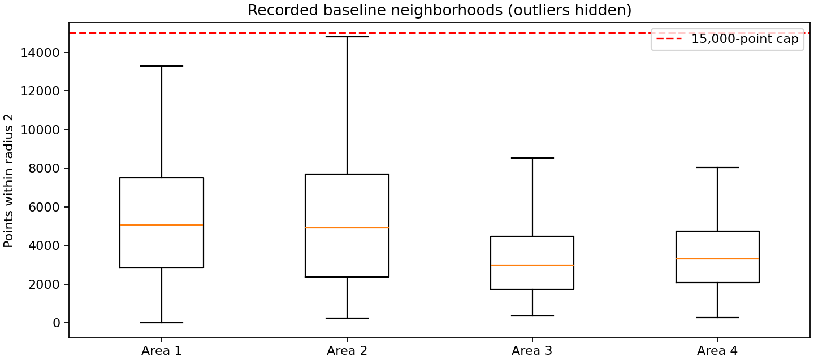

799 of 800 examined neighborhoods require padding. One sampled Area 1 neighborhood contains only one unique point. Padding repeats existing points and the baseline marks those repetitions with a validity mask. The fixed tensor size is consequently much larger than the number of distinct measurements in most sampled neighborhoods.

## Industrial scenes

XY previews can hide vertical overlap and do not establish expert annotation correctness. The files named `sample_*` show class-centered examples with the same radius/cap; they are not randomly selected baseline samples.

### Area_1: Chiller House

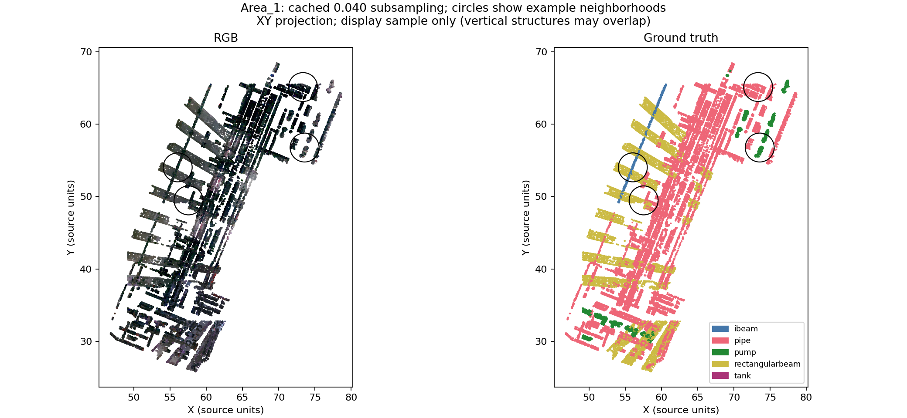

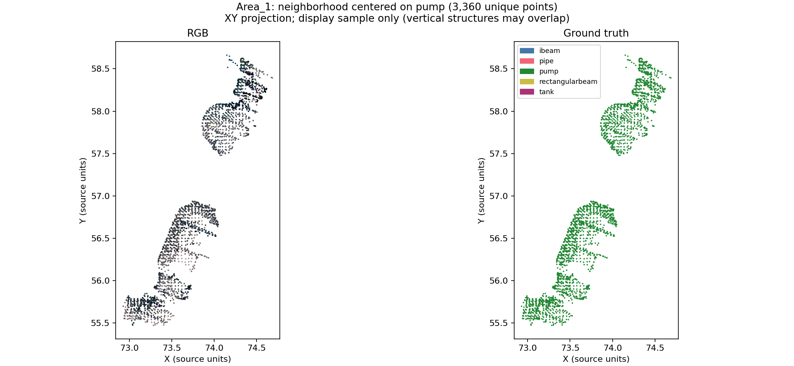

### Area_2: On-Site Chlorine Generation

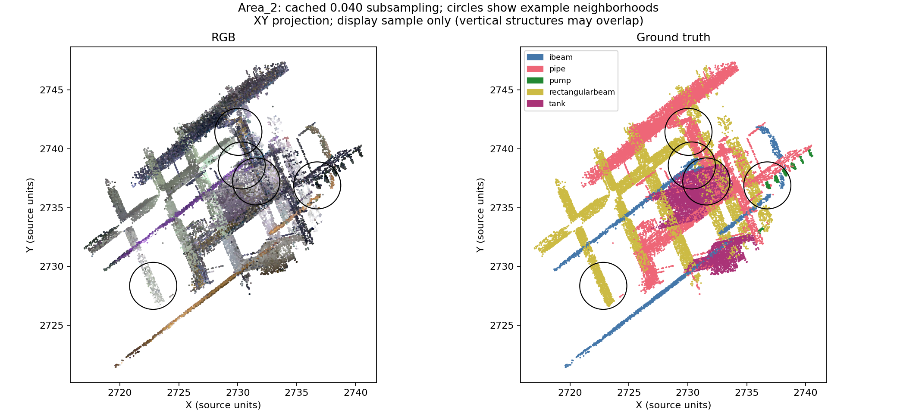

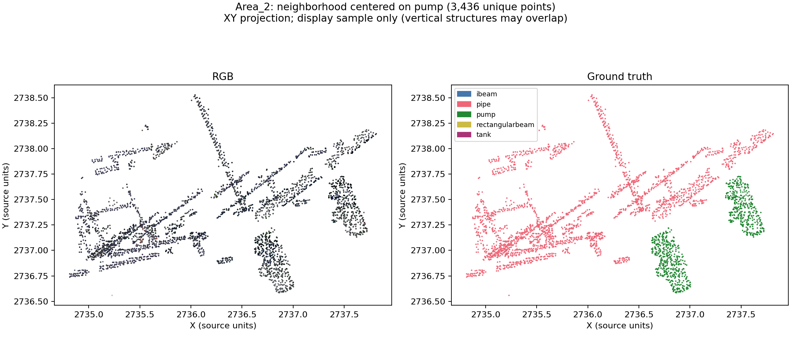

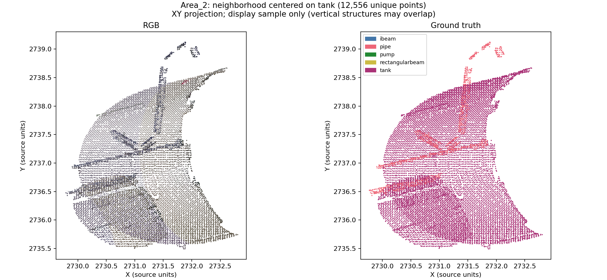

### Area_3: Sludge Press House

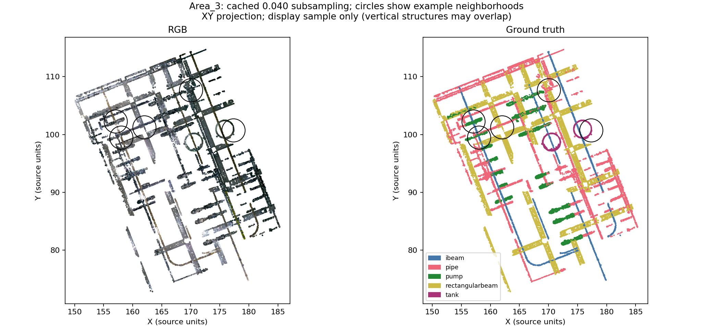

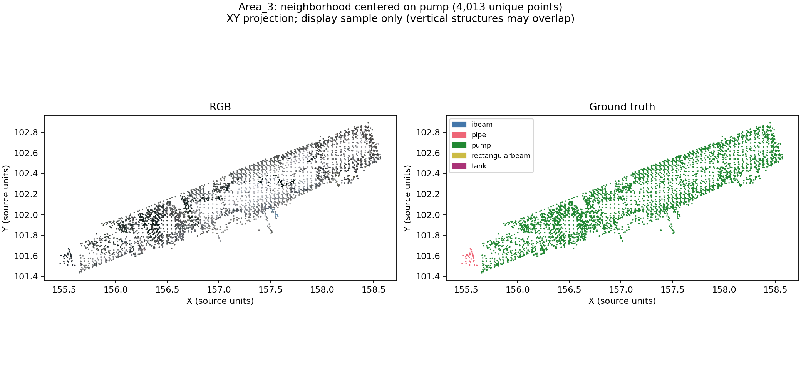

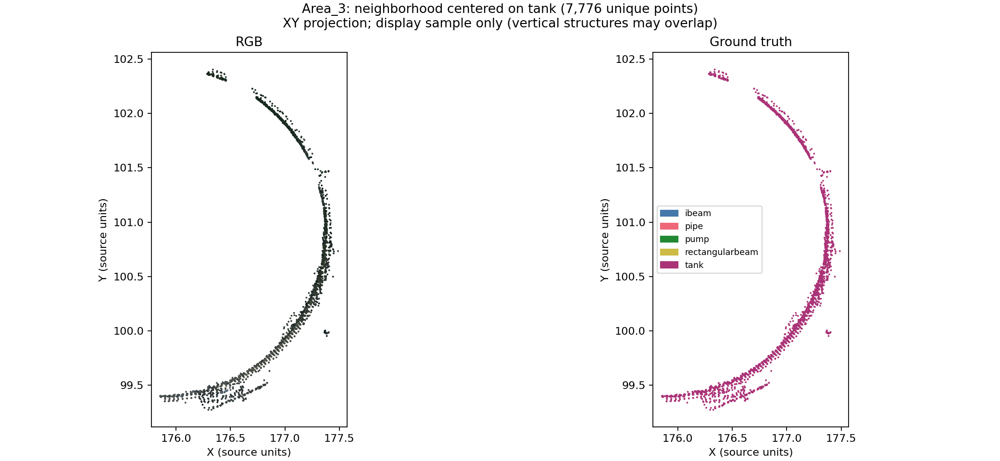

### Area_4: Wash-water Recovery Tank

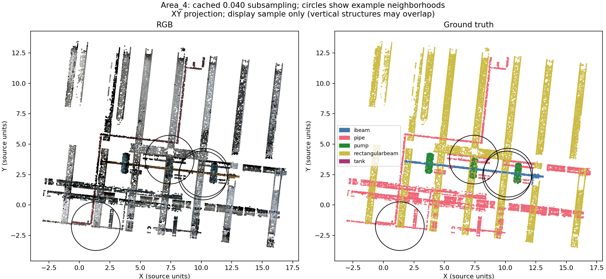

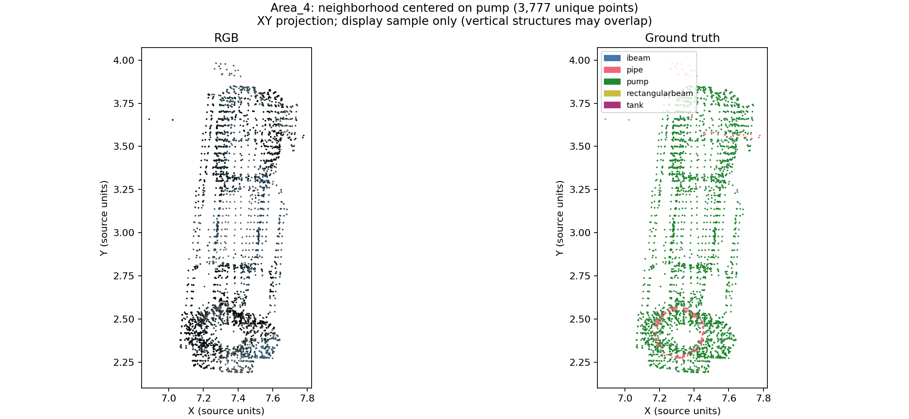

## Training, validation and test partitions

The fixed partition **psnet5-spatial-v1** assigns points to three roles:

- **Training:** points used to update the model's learned parameters.
- **Validation:** separate regions used during development to compare settings and select checkpoints, without training on those points.
- **Test:** all of Area 3, reserved for the final evaluation on a different industrial scene.

Areas 1, 2 and 4 each have a spatial boundary separating training from validation. A spatial split is used because randomly distributing nearby points between the two sets could place almost identical, overlapping neighborhoods in both. Area 3 contributes no points to either development partition.

In the table below, the boundary condition identifies the **validation side**; points below that coordinate threshold belong to training. For example, Area 1 points with Y ≥ 59.361000 are validation points, while points with lower Y are training points. The full-precision thresholds in `split.json` define membership; values shown here are rounded for readability.

Boundaries were selected using only Areas 1, 2 and 4, requiring at least 100 eligible sampling centers of each class present in an area on both sides. An **eligible center** is a subsampled point far enough from the boundary to place a radius-2 neighborhood on its assigned side. These counts measure possible center locations, not the number of training samples or independent objects.

The validation fractions are not uniformly 20%: larger regions are needed to preserve class coverage in Areas 2 and 4. This is particularly important for tanks, which occur in Area 2 but not in the other two training areas.

| Area | Boundary | Validation fraction (subsampled points) | Eligible train / validation centers |
|---|---|---:|---:|
| Area_1 | y ≥ 59.361000 | 20.0% | 332,100 / 56,734 |
| Area_2 | y ≥ 2736.472656 | 50.0% | 130,317 / 127,829 |
| Area_4 | x ≥ 8.553347 | 40.0% | 61,334 / 42,686 |

### Raw-point membership

| Class | Training | Validation | Test (Area 3) |
|---|---:|---:|---:|
| ibeam | 1,003,995 | 479,468 | 3,023,003 |
| pipe | 20,817,678 | 10,747,371 | 8,408,907 |
| pump | 1,727,168 | 867,452 | 2,455,212 |
| rectangularbeam | 10,903,152 | 4,447,237 | 9,055,639 |
| tank | 3,599,401 | 1,856,424 | 1,523,331 |
| **Total** | **38,051,394** | **18,397,952** | **24,466,092** |

Both partitions have eligible centers for every class present in each area. Area 2 still has only 369 eligible pump centers on the training side and 915 tank centers on the validation side. Counts describe correlated points, not independent instances.

### Keeping sampled inputs on their assigned side

The split assigns every raw point to a partition, but not every point is allowed to serve as a neighborhood center. Centers must remain at least 2 coordinate units from the boundary after jitter. For Area 1, training centers must have Y < 57.361000 and validation centers Y ≥ 61.361000, using rounded values here. Points between those limits retain their training or validation membership; the restriction concerns where a sphere can be centered.

In the figures below, the **dashed line** is the membership boundary and the **dotted lines** mark the limits for eligible centers. With an X boundary, validation lies to the right; with a Y boundary, it lies above the line.

The loader protocol partitions raw points before voxelization and restricts each neighborhood search to its assigned partition. This avoids mixing training and validation measurements in a voxel average or sampled input. Any normalization statistics or class weights estimated from data use training points only. These rules are part of the split definition; the saved membership masks alone do not enforce them inside a model loader.

The result is a **point-disjoint spatial split**, not an object-disjoint split: a long pipe or beam can extend across the boundary even though its individual points belong to different sets. Points close to the boundary can also receive limited prediction coverage because nearby centers are excluded. The subsampled fractions and center counts above were measured on verified whole-scene voxel caches; independent partition voxelization can change voxels near the boundary. The raw-point membership totals are exact.

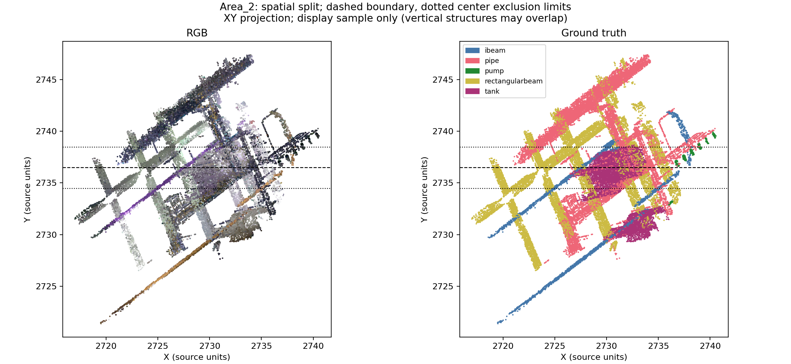

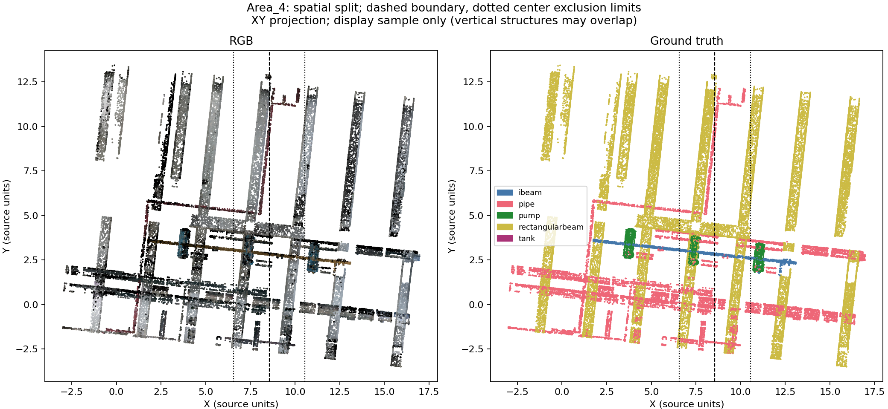

## Reproducibility

The fixed split is recorded in `split.json`. Raw-point ownership masks are stored as packed bits in `results/Area_*_partition.npz`, with a SHA-256 digest identifying the source cache and its point order. Area 3 is assigned wholly to test. The masks define ownership; dataset loaders must apply the documented sampling and voxelization rules.

For model development, the spatial validation regions remain separate from training. After model selection, the benchmark protocol retrains on all of Areas 1, 2 and 4 and evaluates on Area 3.

Audit seed: 20260912. Sampling statistics use 200 recorded baseline neighborhoods per area; class-centered close-ups are illustrative. The accompanying scripts are `audit.py`, `verify_subsampling.py` and `finalize_split.py`.

Evidence: inventory.json, summary.json, class_counts.csv, sampling.json, subsampling_verification.json and split_validation.json in results/.
