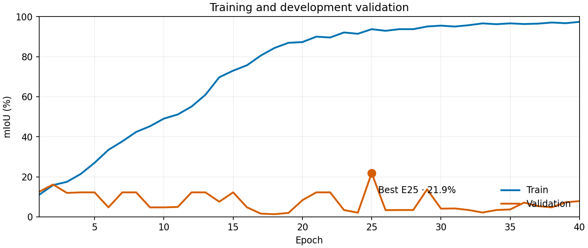
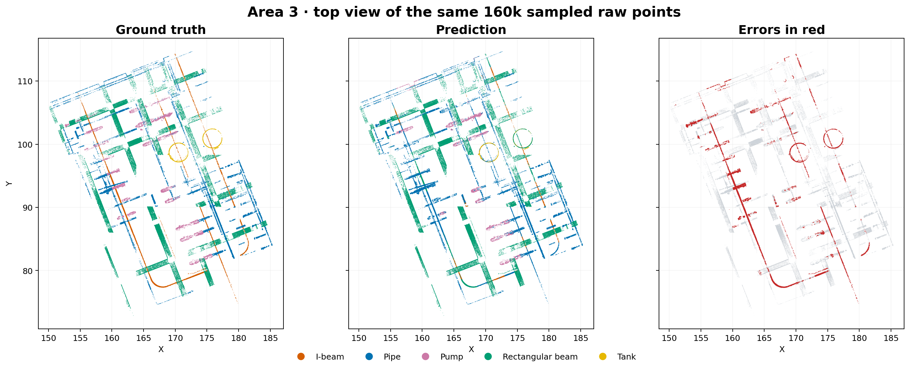
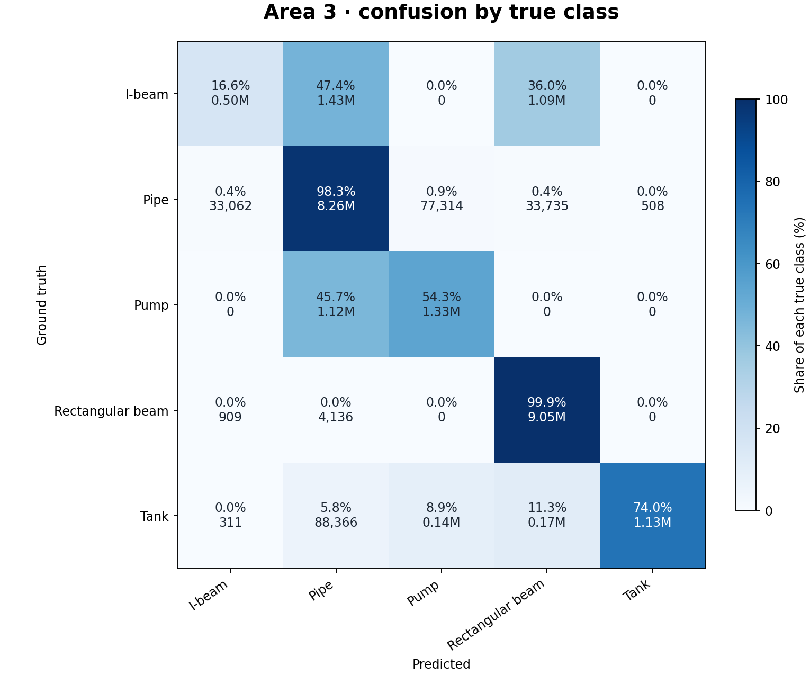

# Earlier BatchNorm 40-epoch run · Area 3 visual report

| Area 3 mIoU | Overall accuracy | Mean class accuracy | Coverage |
|---:|---:|---:|---:|
| **60.5%** | **82.9%** | **68.6%** | **100.0%** |

Training and development validation used spatial partitions of **Areas 1, 2 and 4**. Area 3 was evaluated separately from the saved checkpoint with **1 vote** over all raw points. Legacy development validation selected epoch 25 at **21.9% mIoU** using stored BatchNorm statistics.

## Area 3 predictions

The top view shows the same sampled raw points in each panel. Vertical structures overlap in this projection; red marks incorrect predictions.

| Class | IoU | Recall | Main error |
|---|---:|---:|---|
| I-beam | 16.4% | 16.6% | 47.4% → pipe; 36.0% → rectangular beam |
| Pipe | 74.7% | 98.3% | — |
| Pump | 49.9% | 54.3% | 45.7% → pipe |
| Rectangular beam | 87.5% | 99.9% | — |
| Tank | 73.9% | 74.0% | — |

## BatchNorm evaluation issue

This earlier run selected its checkpoint using stored BatchNorm running statistics. Re-evaluating that checkpoint with current-sphere statistics gives **74.7% development mIoU**. Stored statistics produced misleading development scores for compact, variable-size spheres. The fixed mode uses each evaluation sphere's BatchNorm statistics while leaving dropout in evaluation mode and keeping running buffers unchanged. **This report's Area 3 score uses `current_batch`.** This evaluation option does not change optimizer updates.

## Local source artifacts

- Checkpoint: `psnet5-train-PCM-ngpus1-20261004-190052-iZHeMo9eucRDbunZPvXJuC_ckpt_best.pth` (epoch 25)
- Evaluation: `analysis/psnet5/results/current_checkpoint_area3_fixed_eval/`
- Training log: `log/psnet5/psnet5-train-PCM-ngpus1-20261004-190052-iZHeMo9eucRDbunZPvXJuC/`
